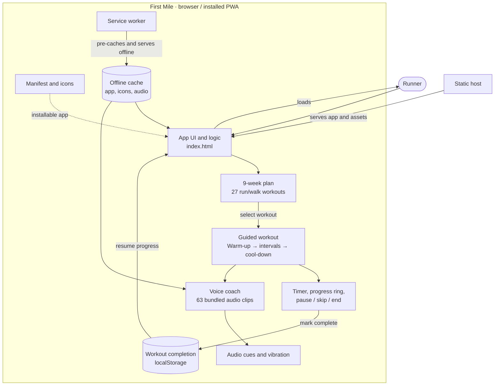

# First Mile

A guided 9-week run/walk plan (Couch to 5K style) as an installable web app.

- `index.html` – the whole app (markup, styles, script)
- `coach/` – Coach Hannah's voice clips (63 MP3s, generated with Kokoro TTS, voice `af_heart`)
- `icons/` – Home Screen icons, plus `app-store-icon-1024.png` for the App Store. All are rendered from `icons/icon.svg`: edit it, then run `swift scripts/make_icons.swift`
- `manifest.json`, `sw.js` – make it installable and usable offline

## App diagram

## Run locally

    python3 -m http.server 8000

Then open http://localhost:8000

## iPhone app

The same `index.html` runs as a native iOS app via [Capacitor](https://capacitorjs.com). In the app, the page works out the workout's timeline of coach lines and beeps and hands it to native code (`native/ios/AppDelegate.swift`), which plays them on time with the screen locked and lowers the runner's music only while the coach speaks.

Needs Node.js and Xcode. First time:

    ./scripts/setup_ios.sh

After changing the web files:

    npm run ios

Then pick your iPhone in Xcode and press Run (set your Apple ID team under Signing & Capabilities first). `native/ios/AppDelegate.swift` is copied into `ios/` by the setup script, so edit it there too or re-copy it.

## Notes

- Every line the coach speaks must have a clip listed in the `CLIP` map in `index.html`. New or reworded lines need new recordings.
- Run `python3 scripts/check_clips.py` to confirm every clip is on disk, in `CLIP`, and cached in `sw.js`.
- After changing any file, bump `CACHE` in `sw.js` so phones pick up the update.
- Host on any static host (GitHub Pages, Netlify, Cloudflare Pages).
